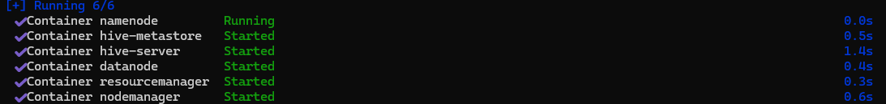

# Requisitos 

Para Windows: 
-Instalar Docker Desktop 
-Tener Docker Compose 
-Asegurarse de que WSL 2 está instalado 

 

Para verificar podemos usar los siguientes comandos: 
```bash
docker –version 
docker-compose –version 
```
 

## Docker + Hadoop + YARN + Hive

1. Crear un nuevo directorio para el proyecto 
2. Crear el archivo docker-compose.yml: 
```bash
services:
  namenode:
    image: bde2020/hadoop-namenode:2.0.0-hadoop3.2.1-java8
    container_name: namenode
    restart: always
    ports:
      - 9870:9870
      - 9000:9000
    volumes:
      - hadoop_namenode:/hadoop/dfs/name
    environment:
      - CLUSTER_NAME=test
    env_file:
      - ./hadoop.env

  datanode:
    image: bde2020/hadoop-datanode:2.0.0-hadoop3.2.1-java8
    container_name: datanode
    restart: always
    ports:
      - 9864:9864
    volumes:
      - hadoop_datanode:/hadoop/dfs/data
    environment:
      SERVICE_PRECONDITION: "namenode:9870"
    env_file:
      - ./hadoop.env
    depends_on:
      - namenode

  resourcemanager:
    image: bde2020/hadoop-resourcemanager:2.0.0-hadoop3.2.1-java8
    container_name: resourcemanager
    restart: always
    ports:
      - 8088:8088
    environment:
      SERVICE_PRECONDITION: "namenode:9000 namenode:9870 datanode:9864"
    env_file:
      - ./hadoop.env
    depends_on:
      - namenode
      - datanode

  nodemanager:
    image: bde2020/hadoop-nodemanager:2.0.0-hadoop3.2.1-java8
    container_name: nodemanager
    restart: always
    ports:
      - 8042:8042
    environment:
      SERVICE_PRECONDITION: "namenode:9000 namenode:9870 datanode:9864 resourcemanager:8088"
    env_file:
      - ./hadoop.env
    depends_on:
      - namenode
      - datanode
      - resourcemanager

  hive-metastore:
    image: mysql:5.7
    container_name: hive-metastore
    restart: always
    environment:
      MYSQL_ROOT_PASSWORD: root
      MYSQL_DATABASE: metastore
      MYSQL_USER: hive
      MYSQL_PASSWORD: hive
    ports:
      - 3307:3306
    volumes:
      - hive-metastore-data:/var/lib/mysql

  hive-server:
    image: bde2020/hive:2.3.2
    container_name: hive-server
    restart: always
    environment:
      HIVE_METASTORE_URIS: thrift://hive-metastore:9083
      HADOOP_CONF_DIR: /usr/local/hadoop/etc/hadoop
      HIVE_HOME: /usr/local/hive
    ports:
      - 10000:10000
    depends_on:
      - hive-metastore
      - namenode
      - datanode
      - resourcemanager

volumes:
  hadoop_namenode:
  hadoop_datanode:
  hive-metastore-data:
```
3. Crear el archivo de variables de entorno hadoop.env: 
```bash
CORE_CONF_fs_defaultFS=hdfs://namenode:9000
CORE_CONF_hadoop_http_staticuser_user=root
CORE_CONF_hadoop_proxyuser_hue_hosts=*
CORE_CONF_hadoop_proxyuser_hue_groups=*
CORE_CONF_io_compression_codecs=org.apache.hadoop.io.compress.SnappyCodec

HDFS_CONF_dfs_webhdfs_enabled=true
HDFS_CONF_dfs_permissions_enabled=false
HDFS_CONF_dfs_namenode_datanode_registration_ip___hostname___check=false

YARN_CONF_yarn_log___aggregation___enable=true
YARN_CONF_yarn_log_server_url=http://historyserver:8188/applicationhistory/logs/
YARN_CONF_yarn_resourcemanager_recovery_enabled=true
YARN_CONF_yarn_resourcemanager_store_class=org.apache.hadoop.yarn.server.resourcemanager.recovery.FileSystemRMStateStore
YARN_CONF_yarn_resourcemanager_scheduler_class=org.apache.hadoop.yarn.server.resourcemanager.scheduler.capacity.CapacityScheduler
YARN_CONF_yarn_scheduler_capacity_root_default_maximum___allocation___mb=8192
YARN_CONF_yarn_scheduler_capacity_root_default_maximum___allocation___vcores=4
YARN_CONF_yarn_resourcemanager_fs_state___store_uri=/rmstate
YARN_CONF_yarn_resourcemanager_system___metrics___publisher_enabled=true
YARN_CONF_yarn_resourcemanager_hostname=resourcemanager
YARN_CONF_yarn_resourcemanager_address=resourcemanager:8032
YARN_CONF_yarn_resourcemanager_scheduler_address=resourcemanager:8030
YARN_CONF_yarn_resourcemanager_resource__tracker_address=resourcemanager:8031
YARN_CONF_yarn_timeline___service_enabled=true
YARN_CONF_yarn_timeline___service_generic___application___history_enabled=true
YARN_CONF_yarn_nodemanager_remote___app___log___dir=/app-logs
```
4. Configurar Hive. Agregamos las dependencias necesarias y las configuraciones en el contenedor de Hive.
Creamos un archivo de configuración hive-site.xml cuyo contenido es:
```bash
<configuration>
  <property>
    <name>javax.jdo.option.ConnectionURL</name>
    <value>jdbc:mysql://hive-metastore:3306/metastore</value>
  </property>
  <property>
    <name>javax.jdo.option.ConnectionDriverName</name>
    <value>com.mysql.cj.jdbc.Driver</value>
  </property>
  <property>
    <name>javax.jdo.option.ConnectionUserName</name>
    <value>hive</value>
  </property>
  <property>
    <name>javax.jdo.option.ConnectionPassword</name>
    <value>hive</value>
  </property>
</configuration>
```
5. Iniciar el cluster 
```bash
docker compose up –d  
 ```


**Si existe ya un contenedor con ese nombre deberemos borrarlo: 
Buscamos el contenedor con el nombre que ya existe y nos da conflicto 
```bash
docker ps –a 
docker stop CONTAINER_name 
docker rm CONTAINER_name 
```

5. Prueba del cluster 

Antes debemos detener y eliminar todos los contenedores
```bash
docker-compose down
 ```
 Verificamos si tenemos algun contenedor en ejecución
 ```bash
docker ps
 ```
 Levantamos el contenedor
```bash
docker compose up –d  
 ```

 Vemos que se ha levantado el contenedor con los servicios de Hive
 


 ## Realizar consultas básicas SQL con el Cliente de Línea de Comandos de Hive

La forma más común de interactuar con Hive es mediante su cliente de línea de comandos. Aquí están los pasos para conectarte al contenedor de Hive y ejecutar consultas SQL:

1. Acceder al Contenedor de Hive
Puedes acceder al contenedor de Hive utilizando docker exec. Primero, verifica que el contenedor de Hive está en ejecución:
```bash
docker ps
```

Luego, ejecuta el siguiente comando para entrar al contenedor:
```bash
docker exec -it hive-server /bin/bash
```

Si nos da error podemos reinciar el contenedor de Hive
```bash
docker-compose restart hive-server
```

2.  Iniciar el Cliente de Hive
Dentro del contenedor iniciamos el cliente de Hive
```bash
hive
```

3. Realizar consultas
  1. Crear una base de datos:
  ```sql
  CREATE DATABASE test_db;
  ```
  2. Usar la base de datos:
  ```sql
  USE test_db;
  ```
  3. Crear una tabla:
  ```sql
  CREATE TABLE test_table (
    id INT,
    name STRING
  );
  ```
  4. Insertar datos en la tabla:
  ```sql
  INSERT INTO TABLE test_table VALUES (1, 'Maria'), (2, 'Juan');
  ```
  5. Consultar datos:
  ```sql
  SELECT * FROM test_table;
  ```

4. Salir del Cliente de Hive
Para salir del cliente de Hive, puedes usar: 
  ```sql
  exit;
  ```

  Y para salir del contenedor:
  ```bash
  exit
  ```